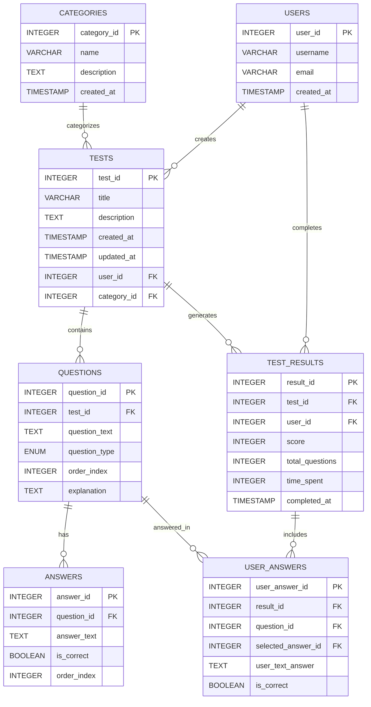

# ER-диаграмма базы данных "Тренажер для подготовки к тестов"

## Описание сущностей

### USERS (Пользователи)
- **user_id** - первичный ключ, уникальный идентификатор пользователя
- **username** - имя пользователя
- **email** - электронная почта
- **created_at** - дата регистрации

### CATEGORIES (Категории)
- **category_id** - первичный ключ
- **name** - название категории
- **description** - описание категории

### TESTS (Тесты)
- **test_id** - первичный ключ
- **title** - название теста
- **description** - описание теста
- **user_id** - создатель теста (внешний ключ)
- **category_id** - категория теста (внешний ключ)

### QUESTIONS (Вопросы)
- **question_id** - первичный ключ
- **test_id** - принадлежность к тесту (внешний ключ)
- **question_text** - текст вопроса
- **question_type** - тип вопроса: single, multiple, text
- **order_index** - порядок в тесте

### ANSWERS (Ответы)
- **answer_id** - первичный ключ
- **question_id** - принадлежность к вопросу (внешний ключ)
- **answer_text** - текст ответа
- **is_correct** - признак правильного ответа

### TEST_RESULTS (Результаты тестов)
- **result_id** - первичный ключ
- **test_id** - пройденный тест (внешний ключ)
- **user_id** - пользователь (внешний ключ)
- **score** - количество правильных ответов
- **total_questions** - всего вопросов в тесте
- **time_spent** - затраченное время (секунды)

### USER_ANSWERS (Ответы пользователя)
- **user_answer_id** - первичный ключ
- **result_id** - принадлежность к результату (внешний ключ)
- **question_id** - вопрос (внешний ключ)
- **selected_answer_id** - выбранный вариант (внешний ключ)
- **user_text_answer** - текстовый ответ пользователя
- **is_correct** - правильность ответа
